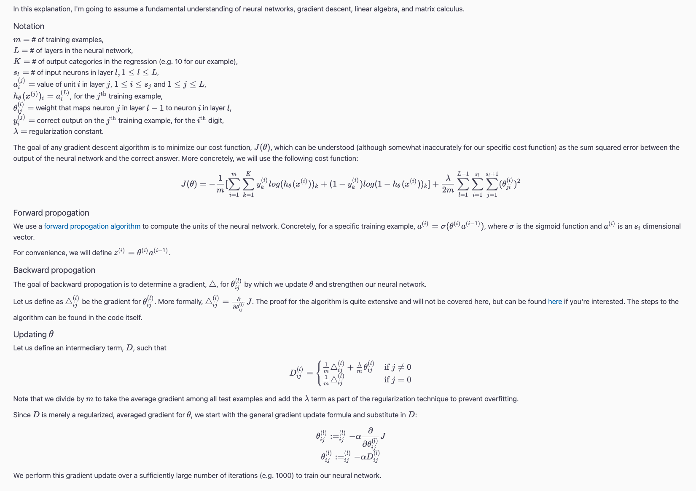

# predict-handwritten-number-neural-network

## Overview

A trained neural network that can predict handwritten numbers, all from scratch! 🌱

The neural network receives 400 pixels vectors, representing greyscale 20 by 20 images containing handwritten numbers. It then uses batch gradient descent, backward propogation, and regularization to train the neural network. I used `numpy`, `pandas`, `matplotlib`, and `PIL` dependencies.

## Batch Gradient Descent vs Mini-batch Gradient Descent
When the number of training examples approaches one million, we begin to see the benefits of mini-batch gradient descent, with a running time of ~60.78s compared to the ~69.72s of batched gradient descent.

## Gradient Descent Algorithm

